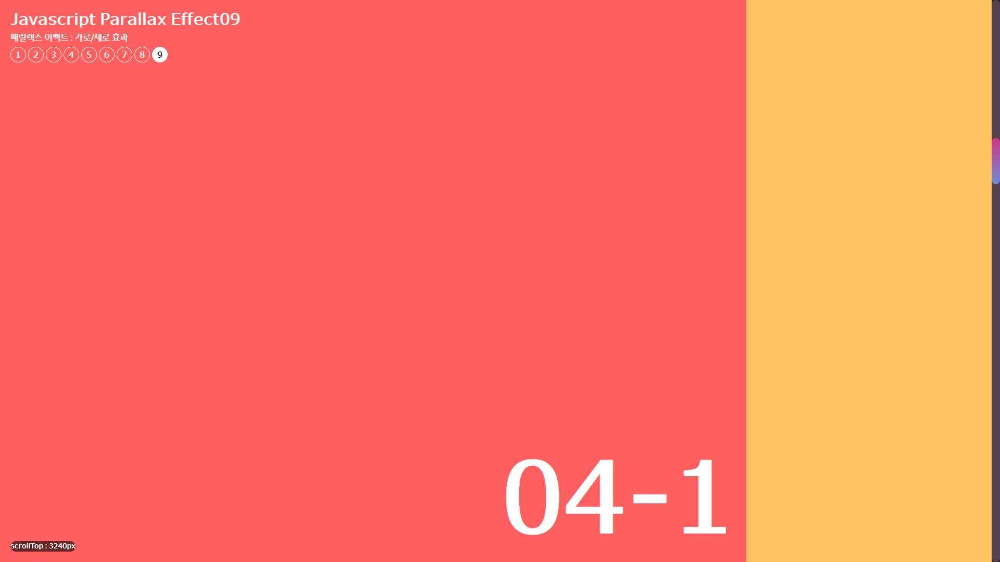

# JS-parallax

자바스크립트로 작성한 parallax 이펙트 입니다. 

******

📓 사용 스택 및 함수(메서드)
---

➡️ HTML: 웹 페이지의 구조를 정의하는 데 사용됩니다.  
➡️ CSS : 웹 페이지와 애플리케이션의 시각적 디자인과 레이아웃을 제어하여 사용자 경험을 향상시키는 스타일링 언어입니다   
➡️ javascript : 
 + setActive(link): setActive() 함수는 링크가 활성화되었을 때 호출되는 함수로서, 메뉴 링크의 활성화 상태를 변경합니다
   
➡️ GSAP :
+ gsap.utils.toArray(): GSAP의 유틸리티 메서드로서, 선택자를 기준으로 해당 요소들을 배열로 반환합니다.    
+ gsap.to(): GSAP 라이브러리의 메서드로, DOM 요소를 애니메이션하는데 사용됩니다.    
+ ScrollTrigger.create(): GSAP의 ScrollTrigger 플러그인을 사용하여 스크롤 이벤트를 관리하고, 특정 요소들을 트리거로 설정합니다.   

➡️ lenis : 부드럽게 스크롤이 되게 해주는 라이브러리 입니다.

# 프로젝트 목적

---

📕  GSAP 이해  
📕  GSAP ScrollTrigger 이해  
📕  lenis 이해  

